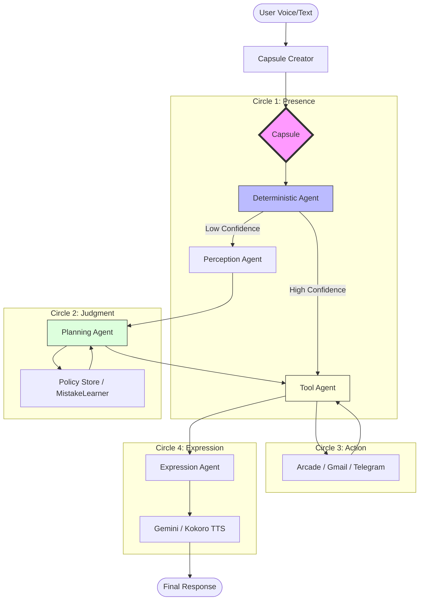

# Blip AI

Blip is a local-first voice assistant with a Vite frontend and a small set of local backends for anything that should not run in the browser, like Gmail OAuth, Google Calendar refresh tokens, Telegram bot messaging, OpenAI image generation, and desktop media actions.

## Architecture

### Frontend
- `Vite` app on `http://localhost:5173`
- UI, voice flow, media UI, notes, and client-side state
- Never stores private OAuth client secrets or server API keys
- Talks to local backends through proxied `/api/...` routes in local dev

### Local backends
- `server/googleCalendarBackend.js`
  Handles Google Calendar OAuth and token refresh
- `server/googleGmailBackend.js`
  Handles Gmail OAuth, inbox reads, and send mail
- `server/telegramBackend.js`
  Handles Telegram bot sends for text and photos
- `server/openaiImageBackend.js`
  Handles OpenAI image requests with server-side API key
- `server/mediaActionsBackend.js`
  Handles local desktop-only actions like wallpaper
- `kokoro_server.py`
  Local Python FastAPI service for Kokoro TTS

### Security model
- Browser gets only the UI and non-secret state
- Secrets stay in `.env.local`
- OAuth refresh tokens are stored locally in `.blip-data/`
- Backends bind to `127.0.0.1` only

## 🧠 Agentic Architecture: Polyphony v2

Unlike standard "wrapper" bots, Blip AI uses a custom agentic orchestration layer called **Polyphony**. This framework enables complex, multi-turn reasoning by routing user intent through a series of specialized agents.



### Key Innovations:
*   **The Capsule System:** A centralized state object that travels through the orchestration pipeline. Each agent (Perception, Planning, Action, and Expression) adds its "partial reading" to the capsule, ensuring a single source of truth for the assistant's context and logic.
*   **Hybrid Brain Logic:** Blip combines a **Deterministic Agent** for zero-latency, high-confidence commands (like local media control) with a **Gemini-powered Planning Agent** for complex, multi-step tasks (like cross-service automation between Gmail and Telegram).
*   **Confidence-Based Routing:** Every intent is assigned a confidence score. If the engine detects a "messy" command or potential hallucination, the **MistakeLearner** logic triggers a soft-confirmation flow or re-routes the task to a more conservative reasoning path.
*   **Arcade Tool Integration:** A unified tool-calling interface that maps natural language intents to real-world actions across third-party APIs, managed by a robust **Policy Store** to ensure safe and predictable execution.

## Recommended local structure

```text
blip-ai/
├── src/                       # frontend app
├── server/                    # local Node backends
├── kokoro_server.py           # local Python TTS backend
├── kokoro_env/                # Python virtual environment
├── .env.local.example         # local environment template
├── start-dev.sh               # one-command local dev launcher
├── package.json
├── vite.config.js
└── .blip-data/                # local tokens + local runtime files
```

## One-command local dev

1. Copy the env template:

```bash
cp .env.local.example .env.local
```

2. Fill in only the keys you actually use in `.env.local`

3. Start everything:

```bash
npm run dev
```

That now starts:
- frontend
- Calendar backend
- Gmail backend
- media actions backend
- optional Kokoro if `kokoro_env` exists

Logs go to:

```text
.blip-data/logs/
```

## Environment variables

Use `.env.local` for local-only secrets and toggles.

Important values:
- `BLIP_FRONTEND_ORIGIN=http://localhost:5173`
- `GOOGLE_CALENDAR_CLIENT_ID=...`
- `GOOGLE_CALENDAR_CLIENT_SECRET=...`
- `GOOGLE_GMAIL_CLIENT_ID=...`
- `GOOGLE_GMAIL_CLIENT_SECRET=...`
- `TELEGRAM_BOT_TOKEN=...`
- `TELEGRAM_CHAT_ID=...`
- `OPENAI_API_KEY=...`

Service toggles:
- `BLIP_ENABLE_KOKORO=1`
- `BLIP_ENABLE_CALENDAR_BACKEND=1`
- `BLIP_ENABLE_GMAIL_BACKEND=1`
- `BLIP_ENABLE_TELEGRAM_BACKEND=0`
- `BLIP_ENABLE_MEDIA_BACKEND=1`
- `BLIP_ENABLE_OPENAI_IMAGE_BACKEND=0`

## Python backend setup

For Kokoro:

```bash
python3 -m venv kokoro_env
source kokoro_env/bin/activate
pip install kokoro-onnx fastapi uvicorn numpy
deactivate
```

Then `npm run dev` will reuse that virtual environment automatically.

## Useful commands

Frontend only:

```bash
npm run dev:web
```

Calendar backend only:

```bash
npm run dev:calendar-backend
```

Gmail backend only:

```bash
npm run dev:gmail-backend
```

Telegram backend only:

```bash
npm run dev:telegram-backend
```

## Telegram quick start

1. In Telegram, chat with `@BotFather`
2. Run `/newbot` and copy the bot token
3. Send one message to your new bot from the Telegram account you want Blip to message
4. Find your chat id by opening:

```text
https://api.telegram.org/bot<YOUR_BOT_TOKEN>/getUpdates
```

5. Put these in `.env.local`:

```bash
TELEGRAM_BOT_TOKEN=...
TELEGRAM_CHAT_ID=...
BLIP_ENABLE_TELEGRAM_BACKEND=1
```

6. Start the backend:

```bash
npm run dev:telegram-backend
```

7. Test a send:

```bash
curl -X POST http://127.0.0.1:8789/api/telegram/send-test
```

## Notes

- `.env.local` is ignored by git
- `.blip-data/` is ignored by git
- If port `5173` is already in use, `start-dev.sh` reuses the existing frontend and only manages the local backends it started
- If `kokoro_env` is missing, the dev stack still starts and warns instead of failing
